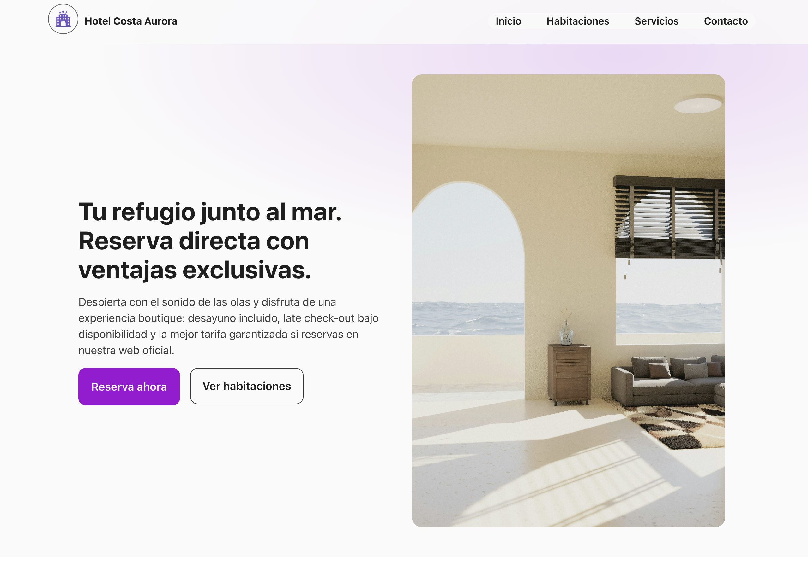
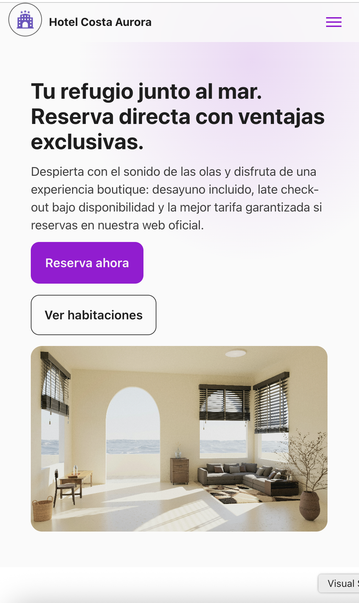
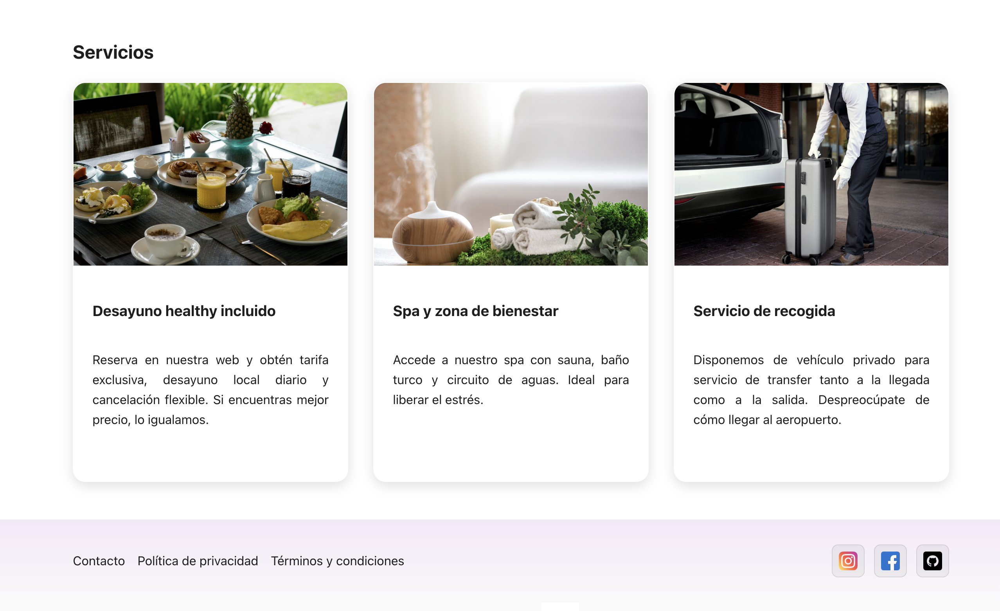

# 🏝️ Hotel Costa Aurora — Mini Landing (Prueba Técnica)

Landing responsive y accesible, maquetada con **HTML semántico** y **SCSS modular**.  
Proyecto realizado como prueba técnica para el puesto de **Maquetación UI en ClickToTravel**.  

👉 [Ver demo en GitHub Pages](https://beatrizgmdevux.github.io/mini-landing-test/)

---

## ✨ Características principales
- **Diseño responsive mobile-first** 📱  
- **Accesibilidad**: navegación con teclado, roles ARIA, skip link  
- **SCSS modular**: estructura clara en `abstracts`, `components` y `layout`  
- **Animaciones suaves** en botones y cards ✨  
- **Hero con CTA destacado** y secciones orientadas a conversión  
- **Footer con redes sociales** y enlaces legales  

---

## 🛠️ Tecnologías usadas
- **HTML5 semántico**  
- **SCSS (Dart Sass)**  
- **Node.js** `18+`  
- **GitHub Pages** para despliegue  

---

## 📂 Estructura del proyecto
```
.
├── index.html                  # Página principal
├── scss/                       # Estilos SCSS organizados por módulos
│   ├── theme/                  # Variables y mixins
│   ├── components/             # Botones, cards, etc.
│   ├── layout/                 # Header, nav, hero, footer, services
│   ├── _base.scss              # Estilos globales
│   ├── _accessibility.scss     # Helpers de accesibilidad
│   └── main.scss               # Punto de entrada
├── public/                     # Recursos estáticos (logo, imágenes, iconos)
│   ├── brand/                  # Logos de marca
│   ├── cards/                  # Imágenes de las cards
│   ├── social/                 # Logos redes sociales
│   └── preview-cards-web.scss  # Captura para previsualización
│   └── preview-hero-web.scss   # Captura para previsualización
│   └── preview-hero-mb.scss    # Captura para previsualización
├── dist/                       # CSS compilado
├── js/                         # Lógica mínima: burger menu accesible
├── package.json                # Scripts y dependencias
└── README.md                   # Este archivo
```

---

## 🚀 Scripts
```bash
# Desarrollo: compila SCSS en watch + servidor local (http://localhost:5173)
npm run dev

# Compilación optimizada para producción
npm run build
```

---

## 📸 Vista previa

  
  

---

## 👩🏻‍💻 Autora
**Beatriz García Muñoz**  
- Maquetadora UI & UX/UI Designer
- [LinkedIn](https://www.linkedin.com/in/beatriz-garc%C3%ADa-mu%C3%B1oz-46144a11a/) 

---

✨ *Gracias por la oportunidad. Este proyecto demuestra mi enfoque en maquetación accesible, modular y orientada al detalle visual.*  
